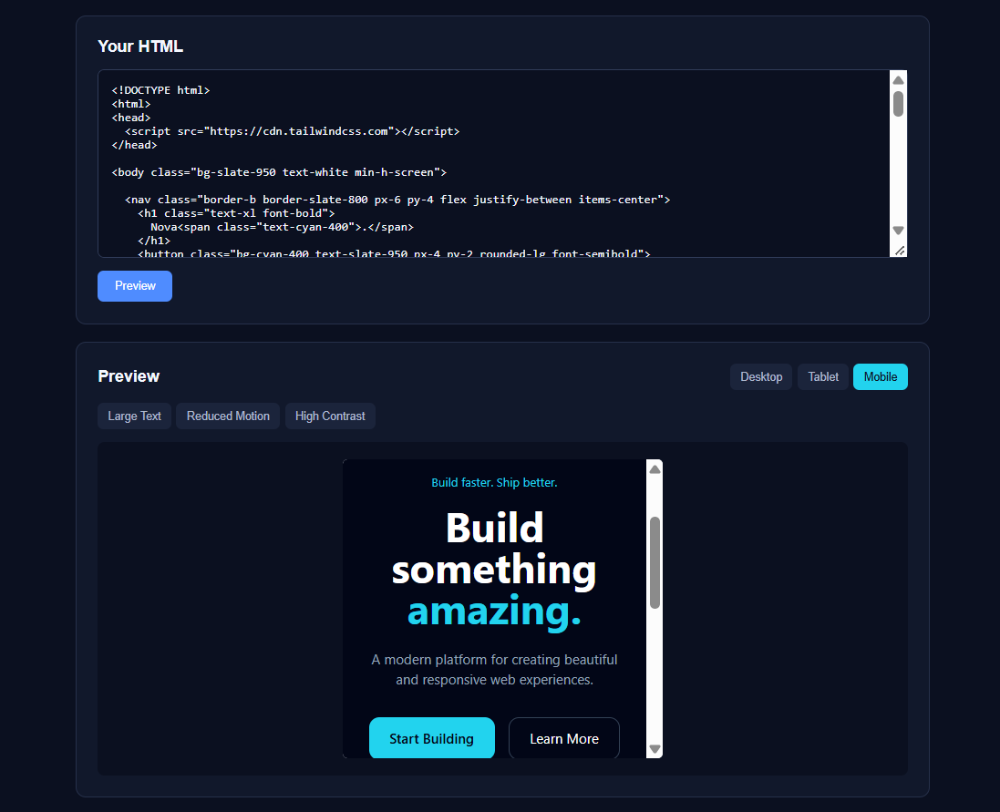

# Mirror

### Frontend UI stress-testing tool

Mirror lets developers preview HTML at different screen sizes and check for common UI and accessibility issues.

## Features

- HTML preview
- Mobile, tablet and desktop views
- UI issue detection
- Accessibility checks
- Large text testing
- Reduced motion testing
- High contrast testing

## Tech Stack

- HTML
- CSS
- JavaScript
- DOM Manipulation
- iframe

## How It Works

Paste HTML into Mirror and preview it at different viewport sizes. Mirror scans the rendered page for common UI and accessibility problems and provides simple testing modes.

## Future Improvements

- CSS issue detection
- Color contrast analysis
- Keyboard navigation testing
- More accessibility checks
- Export test results